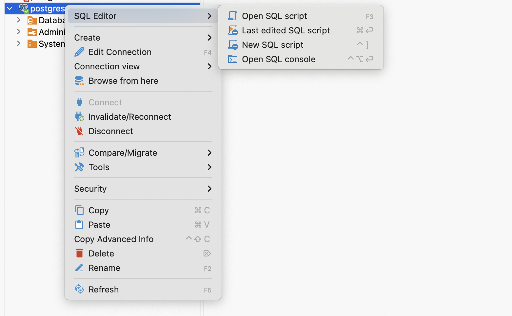
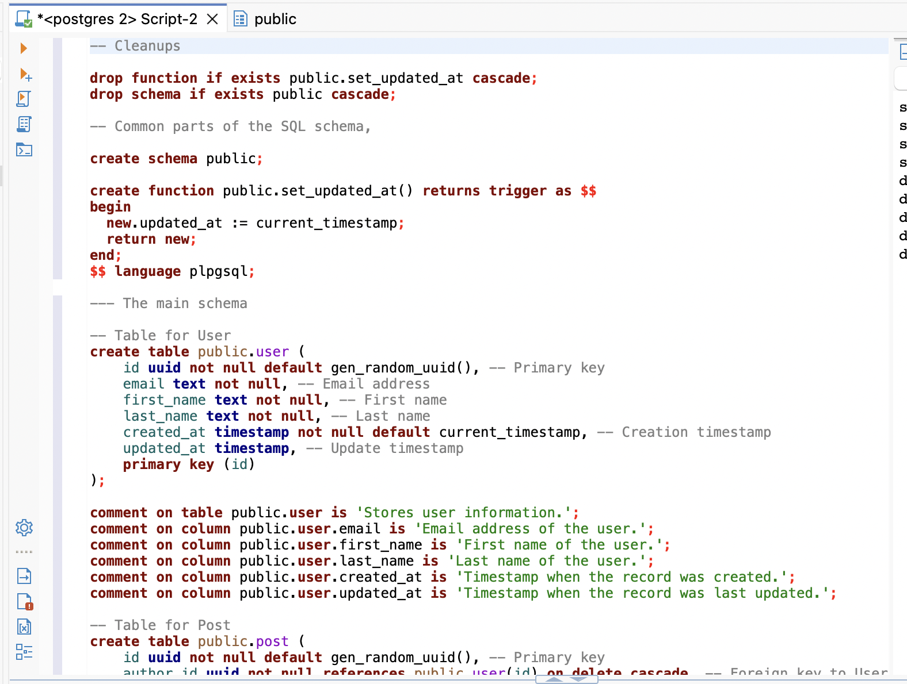
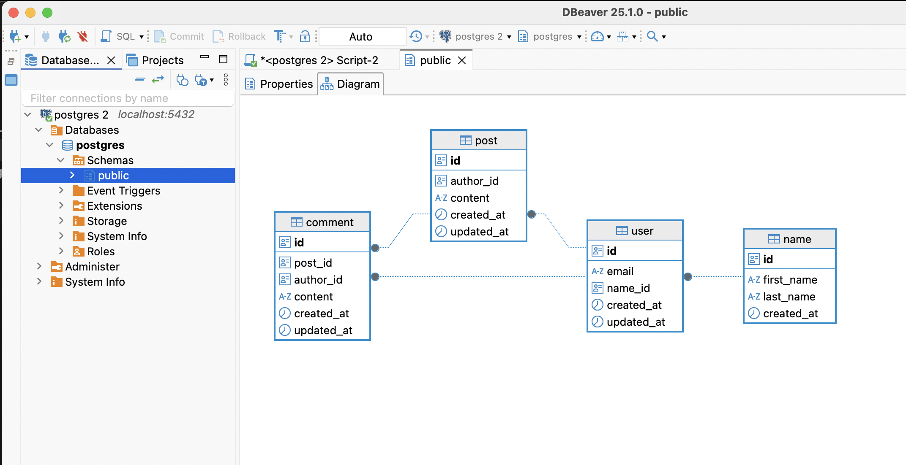

# Generative AI and working in the context of SQL databases

I had an excellent use case for AI assisted development land on my lap. The use of GenAI really felt like a productivity improvement, the actual task at hand was performed at that magical 10x productivity boost.

In our customer project, we are starting to build a data model from scratch and we have quite extensively mapped through various use cases. We've got some mocked functionality in both the frontend and the backend, all wired up. 

We are at a point, where we are fully lacking a database layer but we have some representation of the data types in the codebase.

The internet has been describing success stories in working with the data layer. The SQL is really an established, well documented and a topic with a lot of prior art - so the LLM should perform pretty well.

The goal in this exercise was to come up with a reference database model in a reasonably short time frame, populate it with some seed data and experiment a bit with various design patterns, views, functions and queries.

## Setup

### Data seed

We have stuff in a kotlin backend, we had a rough starting point like the following. Just simple data classes.

```kotlin

// Model.kt
@Serializable
data class Name(val: firstName: String, val lastName: String)

@Serializable
data class User(val id: String, val email: String, val name: Name, createdAt: LocalDateTime)

@Serializable
data class Post(val id: String, val author: User, val content: String, createdAt: LocalDateTime)
@Serializable
data class Comment(val id: String, val post: Post, val author: User, content: String, createdAt: LocalDateTime)
```

### SQL style

 The output SQL will be opinionated. CoPilot is set up to use the following rules for database work using  `./github/copilot-instructions.md`

```md
## Database & SQL

- Always use `id` of uuid type for primary keys using `gen_random_uuid`
- Use `created_at` timestamps for all tables
- Set up the trigger function `set_updated_at` for each table for all updates
- Prefer non-nullable types where possible
- Always set up table and column comments
- Prefer checks on upsert instead of enums
```

### DEV env setup

We set up a scratch pad as in throwaway database to work

```bash
docker run --name postgres-db -e POSTGRES_PASSWORD=super_secret -p 5432:5432 postgres
```

1. Download install and run [DBeaver](https://dbeaver.io/) 
   - Connect to locally running PostgreSQL with `super_secret` as your password, using connection defaults
   - Start the SQL console


### Main SQL, `001.sql`

Take the following SQL snippet, store it as something like `001.sql` in lack of a better name.

```sql
---- 001.SQL

-- Cleanups, resets

drop function if exists public.set_updated_at cascade;
drop schema if exists public;

-- Common parts of the SQL schema,

create schema public;

create function public.set_updated_at() returns trigger as $$
begin
  new.updated_at := current_timestamp;
  return new;
end;
$$ language plpgsql;

--- The main schema

--- Schema content goes here
```

### Prompt cycle

1. Ask the AI something like the following 
2. Review the output, paste the output to the DBeaver SQL console and execute the script. 
3. Important! *REFRESH* your database (yes, DBeaver is clunky app at times) - but you'll get something like the following 

### Conclusion

Now that you have the schema, you're free to start iterating steps 5 - 6
   
2. Fool around!
    - Ask the AI to fine tune your schema, eg. to provide an updated version by getting rid of the `Name` table?
     - Change the naming convention?
     - Extend the schema?
     - Try making status field for user with various states?